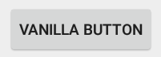
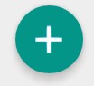
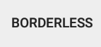
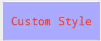
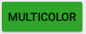
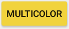

# Button

Buttons are the simplest UI widget that allows user interaction. Taps of the
button can be used to trigger actions in your app.

## Button Types

Within Android, there are four main button "types".

### Text

The standard button contains just text:



It has the class `Button`, and creating it in layout XML is as follows:

```xml
  <Button
    android:layout_width="wrap_content"
    android:layout_height="wrap_content"
    android:text="Vanilla Button"
    ... />
```

The text for the button is set using the `android:text` attribute.

`Button` is a subclass of `TextView` and hence `View`, so the standard
attributes apply.

### Image

The `ImageButton` class allows you to make a button containing an image instead
of text:


`ImageButton` is a subclass of `ImageView`, so providing the image is done via
the `android:src` attribute. This should be some form of a `@drawable`:

```xml
<ImageButton
  android:layout_width="wrap_content"
  android:layout_height="wrap_content"
  android:src="@mipmap/raywenderlich"
  ... />
```


### Image & Text

You've seen text buttons, and image buttons - but what you really want is both:


Luckily, this is made possible through the "drawable" functionality of the
`TextView` superclass of `Button`:

```xml
<Button
  android:layout_width="wrap_content"
  android:layout_height="wrap_content"
  android:text="Text and Image"
  android:drawableStart="@mipmap/raywenderlich"
  android:drawableLeft="@mipmap/raywenderlich"
  android:drawablePadding="10dp"
  ... />
```

The text for the button is once again provided by the `android:text`
attribute. The image is a `@drawable` set on the `android:drawableStart`
attribute.

> __NOTE:__ The `android:drawableLeft` is also used as a fallback for pre-API
> level 14. `android:drawableStart` will respect the writing direction, unlike
> `android:drawableLeft`.

The spacing between the image and the text is controlled by the
`android:drawablePadding` attribute.


### Floating Action Button (FAB)

Material Design introduces a new type of button, known as the Floating Action
Button (FAB):



It is possible to create a FAB using the Design Support Library. This was
introduced in v22.2.0, so ensure that you've got that version installed using
the SDK manager.

Then make sure you add the design support library as a build dependency in
__build.gradle__:

```gradle
dependencies {
  compile "com.android.support:design:22.2.0"
  ...
}
```

You can then use the `FloatingActionButton` class:

```xml
<android.support.design.widget.FloatingActionButton
  <!-- Workaround -->
  xmlns:app="http://schemas.android.com/apk/res-auto"
  app:borderWidth="0dp"
  <!-- End workaround -->
  android:layout_width="wrap_content"
  android:layout_height="wrap_content"
  android:layout_marginBottom="16dp"
  android:layout_marginTop="16dp"
  android:layout_gravity="center_horizontal"
  android.support.design:fabSize="normal"
  android:src="@drawable/plus"
  />
```

`FloatingActionButton` is a subclass of `ImageView`, so you need to provide the
icon as a `@drawable` to the `android:src` attribute.

The `android.support.design:fabSize` attribute can be `normal` or `mini`.

## Creating Button from Code

In code, the `Button` class represents push buttons. The following creates a
simple text button:

```java
// 1:
newButton = new Button(this);
// 2:
newButton.setText("Magic Button");
// 3:
LayoutParams layoutParams = new LayoutParams(WRAP_CONTENT, WRAP_CONTENT);
layoutParams.gravity = Gravity.CENTER_HORIZONTAL;
newButton.setLayoutParams(layoutParams);

// 4:
LinearLayout buttonContainer = (LinearLayout)findViewById(R.id.button_container);
buttonContainer.addView(newButton);
```

1. Creating a button calls a constructor that requires a `Context`. This code is
within an activity, so `this` is the appropriate context.
2. The `setText()` method is used to configure the button.
3. (Implementation detail) This button will live within a `LinearLayout`, so
the layout parameters are an instance of `LinearLayout.LayoutParams`. Setting
the params on the button uses the `setLayoutParams()` method.
4. `Button` is an indirect subclass of `View`, so it is added to the layout
using the `addView()` method.

`Button` is a subclass of `TextView`, so for more details on the methods
available to you in code, check out details on `TextView`.

## Button Styling

Styling buttons is in line with styling other UI components on Android. They
will respect the theme of the app, in addition to their own `style` attributes.

There is one style that is particularly applicable to buttons - used to create a
borderless button:



This is created as follows:

```xml
<Button
  android:layout_width="wrap_content"
  android:layout_height="wrap_content"
  android:text="Borderless"
  style="?android:borderlessButtonStyle" />
```

You can also create your own styles, defining them in the __res/values/__
resources directory.



For example, the following is a custom style definition:

```xml
<style name="CustomButton" parent="Base.Widget.AppCompat.Button.Borderless">
  <item name="android:textAllCaps">false</item>
  <item name="android:textColor">#F23E2E</item>
  <item name="android:typeface">monospace</item>
  <item name="android:background">#aaf</item>
  <item name="android:padding">10dp</item>
</style>
```

This is invoked as follows:

```xml
<Button
  android:layout_width="wrap_content"
  android:layout_height="wrap_content"
  android:text="Custom Style"
  style="@style/CustomButton" />
```

The one remaining commonly used styling feature is the ability to change the
color or background of a button based on whether or not it is being pressed.

For example, the left image shows the button in its default state, whilst the
right image shows it whilst it's being pressed:




This is achieved using a `ColorStateList`, although if you want to change the
background image, you can do the same with a `StateListDrawable`.

You define a `ColorStateList` in the __res/color__ resources directory:

```xml
<?xml version="1.0" encoding="utf-8"?>
<selector xmlns:android="http://schemas.android.com/apk/res/android">
  <item android:color="#F23E2E"
        android:state_focused="true" />
  <item android:color="#F2D43D"
        android:state_pressed="true" />
  <item android:color="#2EA629" />
</selector>
```

This consists of a list of `item` tags, each of which define a color and a
_state_ associated with that color. There are many different states - here the
important state is `android:state_pressed`, which refers to when the user has
their finger on the button.

The final item in the list specifies the default color. Think of the list as a
fall-through matching list - the default color will only be matched if none of
the previous items are.

Using this on your button is simple:

```xml
<Button
    android:layout_width="wrap_content"
    android:layout_height="wrap_content"
    android:text="MultiColor"
    android:backgroundTint="@color/multicolor_button" />
```


## Handling Button Taps


## Useful Properties

